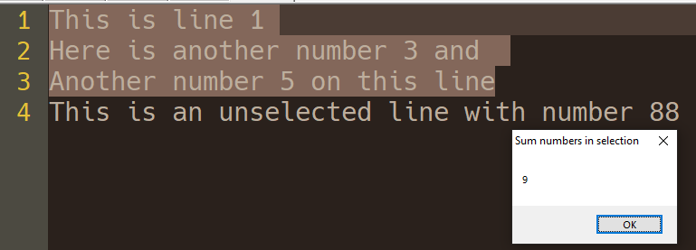

# SelTextCalculator
This plugin can sum and multiply numbers on selected text in Notepad Plus Plus.

## KeyBindings
- Ctrl + Alt + A : Sum all numbers in selected text;
- Ctrl + Alt + M : Multiply all numbers in selected text;

## Screen shots
### Sum
Messagebox showing the sum of numbers in selected text

### Multiplication
Messagebox showing the multiplication of numbers in selected text

